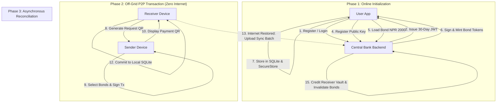
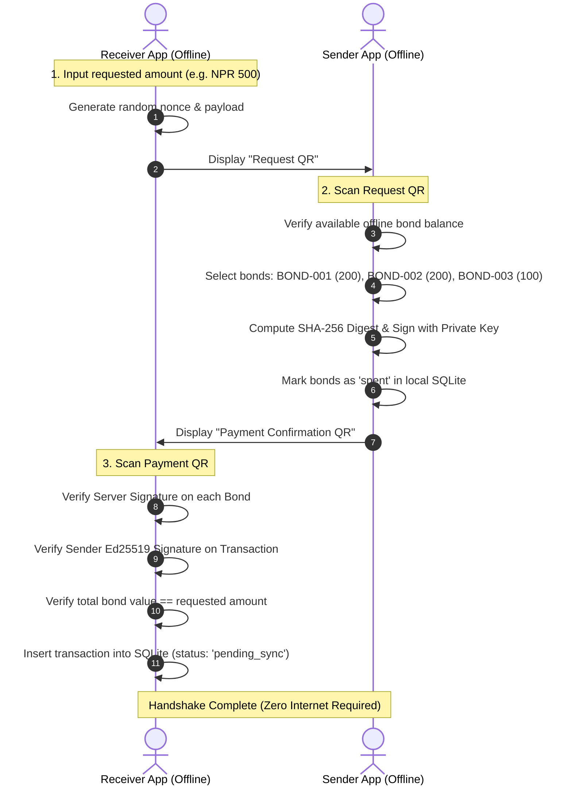

# OffPay: Complete System Architecture, Cryptographic Specification & Product Prospectus

> **OffPay (HimaliX)**: A decentralized, offline-first digital payment ecosystem engineering secure, verified peer-to-peer monetary transactions across zero-connectivity environments.

---

## 📑 Table of Contents
1. [Executive Summary & Problem Statement](#1-executive-summary--problem-statement)
2. [The OffPay Token Paradigm: Digital Banknotes](#2-the-offpay-token-paradigm-digital-banknotes)
3. [End-to-End System Architecture](#3-end-to-end-system-architecture)
4. [Cryptographic Specifications & Security Proofs](#4-cryptographic-specifications--security-proofs)
5. [Two-Way Dynamic QR Handshake Protocol](#5-two-way-dynamic-qr-handshake-protocol)
6. [Asynchronous Synchronization & Double-Spend Defense](#6-asynchronous-synchronization--double-spend-defense)
7. [Database Schema Specifications (Frontend & Backend)](#7-database-schema-specifications-frontend--backend)
8. [Mobile Application Walkthrough & Component Architecture](#8-mobile-application-walkthrough--component-architecture)
9. [Developer Setup, Build & Running Guide](#9-developer-setup-build--running-guide)
10. [Threat Modeling & Attack Vector Mitigations](#10-threat-modeling--attack-vector-mitigations)
11. [Product Prospectus, Pitch Script & Hackathon Q&A](#11-product-prospectus-pitch-script--hackathon-qa)

---

## 1. Executive Summary & Problem Statement

### 1.1 The Limitation of Traditional E-Wallets
Traditional digital payment systems (eSewa, Khalti, Apple Pay, Google Pay) rely exclusively on **centralized account-based ledgers**. When Alice sends money to Bob:
1. Alice's device connects to a central server.
2. The server authenticates Alice, verifies her balance, decrements her account, increments Bob's account, and returns a confirmation.

In this architecture, **real-time synchronous internet connectivity is a mandatory prerequisite**. If either counterparty lacks internet access, the transaction fails completely.

### 1.2 The Real-World Reality
* **Remote & Highland Regions**: In trekking routes, rural districts, and disaster-affected zones of Nepal, cellular coverage is non-existent. Residents and tourists are forced to rely solely on physical cash.
* **Urban Friction & Data Costs**: Even in metropolitan centers (Kathmandu, Pokhara), free Wi-Fi is either unavailable, unsafe, or cellular mobile data is cost-prohibitive for micropayments (e.g., spending NPR 10 on mobile data to pay NPR 20 for tea).
* **Cash Vulnerabilities**: Physical cash is vulnerable to theft, loss, physical damage, and lacks a digital audit trail.

### 1.3 The OffPay Solution
**OffPay** introduces a hybrid digital payment model. Users convert portions of their online liquid bank balance into **cryptographically signed offline bearer tokens (Bonds)**. These tokens can be transferred directly between two devices using a two-way dynamic QR code handshake with **zero internet or cellular network connectivity**, backed by Ed25519 digital signatures.

---

## 2. The OffPay Token Paradigm: Digital Banknotes

Instead of a single mutable balance integer on a server, OffPay treats offline money analogously to **physical banknotes**:

```
┌────────────────────────────────────────────────────────┐
│                   OFFPAY BOND TOKEN                    │
├────────────────────────────────────────────────────────┤
│ • Bond ID: BOND-9a8f2e-500                             │
│ • Denomination: NPR 500                                │
│ • Owner UUID: usr-a1b2c3d4-e5f6-7890                   │
│ • Issued At: 2026-08-22T08:00:00Z                      │
│ • Expiry: 2026-09-22T08:00:00Z (30 Days)               │
│ • Server Ed25519 Watermark: 302a3005... (64 bytes)     │
└────────────────────────────────────────────────────────┘
```

1. **Fixed Denominations**: Bonds are issued in standard denominations: **NPR 100, 200, 500, 1000**.
2. **Server Watermark**: Each bond carries a tamper-proof digital signature from the central bank server.
3. **Local Storage**: Bonds are stored in the user's encrypted local SQLite database.
4. **Velocity Limit**: To bound financial risk, users can hold a maximum of **NPR 3,000** in active offline bonds simultaneously.

---

## 3. End-to-End System Architecture



---

## 4. Cryptographic Specifications & Security Proofs

OffPay implements a zero-trust cryptographic verification model.

### 4.1 Algorithms & Key Sizes
* **Signature Scheme**: **Ed25519** (Edwards-curve Digital Signature Algorithm over Curve25519).
  - Public Key: 32 bytes (64 hex characters).
  - Private Key: 32 bytes (stored in hardware-backed SecureStore / Keychain / Keystore).
  - Signature Size: 64 bytes (128 hex characters) — compact enough for dynamic QR codes.
* **Cryptographic Hash**: **SHA-256** for payload digest creation.
* **Nonce Generation**: 16-byte cryptographically secure random hexadecimal string per transaction to prevent replay attacks.

### 4.2 Mathematical Payloads & Signatures

#### A. Server Bond Issuance Signature
When the server mints a bond, it creates a digest:
$$\text{Digest}_{\text{bond}} = \text{SHA-256}(\text{bondId} \parallel \text{value} \parallel \text{ownerId} \parallel \text{issuedAt} \parallel \text{expiresAt} \parallel \text{"OFFPAY\_SERVER"})$$
$$\text{Signature}_{\text{server}} = \text{Ed25519\_Sign}(\text{PrivateKey}_{\text{server}}, \text{Digest}_{\text{bond}})$$

#### B. Offline P2P Transaction Signature
When the sender transfers bonds to the receiver:
$$\text{Digest}_{\text{tx}} = \text{SHA-256}(\text{txId} \parallel \text{bondIds} \parallel \text{senderId} \parallel \text{receiverId} \parallel \text{totalAmount} \parallel \text{timestamp} \parallel \text{nonce})$$
$$\text{Signature}_{\text{sender}} = \text{Ed25519\_Sign}(\text{PrivateKey}_{\text{sender}}, \text{Digest}_{\text{tx}})$$

---

## 5. Two-Way Dynamic QR Handshake Protocol



### JSON QR Payloads

#### 1. Request QR Payload (`OFFPAY_REQUEST`)
```json
{
  "type": "OFFPAY_REQUEST",
  "receiverId": "usr-b2c3d4e5-f6a7-8901",
  "receiverName": "Sita Devi",
  "amount": 500,
  "currency": "NPR",
  "timestamp": "2026-08-22T10:15:30Z",
  "nonce": "e4a78c1b9f023d45"
}
```

#### 2. Payment QR Payload (`OFFPAY_PAYMENT`)
```json
{
  "type": "OFFPAY_PAYMENT",
  "txId": "tx-8f2a1b9c-4e3d-7890",
  "senderId": "usr-a1b2c3d4-e5f6-7890",
  "receiverId": "usr-b2c3d4e5-f6a7-8901",
  "totalAmount": 500,
  "bonds": [
    {
      "bondId": "BOND-001",
      "value": 200,
      "serverSignature": "302a300506032b6570032100d7a8f0c1e2b3..."
    },
    {
      "bondId": "BOND-002",
      "value": 200,
      "serverSignature": "8a7b9c1d2e3f4a5b6c7d8e9f0a1b2c3d4e5f..."
    },
    {
      "bondId": "BOND-003",
      "value": 100,
      "serverSignature": "f1e2d3c4b5a697887766554433221100aabb..."
    }
  ],
  "timestamp": "2026-08-22T10:16:02Z",
  "nonce": "e4a78c1b9f023d45",
  "senderSignature": "7c8d9e0f1a2b3c4d5e6f7a8b9c0d1e2f3a4b..."
}
```

---

## 6. Asynchronous Synchronization & Double-Spend Defense

### 6.1 Single-Party Sync Guarantee
A critical innovation of OffPay is that **only ONE party needs to come online** to settle the transaction on the central server.
* If the **Receiver** reconnects first, uploading the signed voucher settles the funds into their online account and invalidates the sender's bonds.
* If the **Sender** reconnects first, their sync batch confirms the transfer and releases pending locks.

### 6.2 Server-Side Fraud Engine
When `/transactions/sync` is invoked:
1. **Bond Authenticity Check**: Re-verifies server signature on all submitted bond tokens.
2. **Sender Signature Verification**: Looks up sender's registered public key and verifies `senderSignature`.
3. **Double-Spend Detection**: Queries the `bond_redemptions` table.
   - If a `bond_id` has already been redeemed in a previous transaction, the transaction is rejected.
   - A `DOUBLE_SPEND` incident is instantly logged in `fraud_flags` with `CRITICAL` severity, flagging the offending user account for automated suspension.

---

## 7. Database Schema Specifications

### 7.1 Frontend SQLite Schema (Local Mobile Database)

```sql
-- Encrypted local bonds
CREATE TABLE IF NOT EXISTS bonds (
    bond_id TEXT PRIMARY KEY,
    value INTEGER NOT NULL,
    owner_id TEXT NOT NULL,
    issued_at TEXT NOT NULL,
    expires_at TEXT NOT NULL,
    server_signature TEXT NOT NULL,
    status TEXT CHECK(status IN ('available', 'spent', 'pending_sync')) NOT NULL DEFAULT 'available'
);

-- Local transaction audit trail
CREATE TABLE IF NOT EXISTS transactions (
    tx_id TEXT PRIMARY KEY,
    type TEXT CHECK(type IN ('sent', 'received', 'topup', 'bond_load', 'bond_reverse')) NOT NULL,
    amount INTEGER NOT NULL,
    counterparty TEXT NOT NULL,
    timestamp TEXT NOT NULL,
    status TEXT CHECK(status IN ('completed', 'pending', 'synced', 'failed')) NOT NULL,
    is_offline INTEGER NOT NULL DEFAULT 1,
    payload_json TEXT
);

-- Outbox queue for automatic sync upon reconnection
CREATE TABLE IF NOT EXISTS sync_queue (
    queue_id TEXT PRIMARY KEY,
    tx_id TEXT NOT NULL,
    payload TEXT NOT NULL,
    created_at TEXT NOT NULL,
    retry_count INTEGER DEFAULT 0
);
```

### 7.2 Backend PostgreSQL Schema (Central Banking Ledger)

```sql
-- Registered User Accounts & Keys
CREATE TABLE users (
    user_id UUID PRIMARY KEY DEFAULT gen_random_uuid(),
    full_name VARCHAR(100) NOT NULL,
    phone VARCHAR(20) UNIQUE NOT NULL,
    email VARCHAR(100) UNIQUE NOT NULL,
    password_hash VARCHAR(255) NOT NULL,
    public_key TEXT NOT NULL,
    online_balance NUMERIC(12, 2) NOT NULL DEFAULT 0.00,
    created_at TIMESTAMPTZ DEFAULT NOW()
);

-- Authoritative Bond Issuance Record
CREATE TABLE issued_bonds (
    bond_id VARCHAR(64) PRIMARY KEY,
    owner_id UUID REFERENCES users(user_id),
    value INTEGER NOT NULL,
    server_signature TEXT NOT NULL,
    status VARCHAR(20) CHECK (status IN ('active', 'spent', 'revoked')) DEFAULT 'active',
    issued_at TIMESTAMPTZ DEFAULT NOW(),
    expires_at TIMESTAMPTZ NOT NULL
);

-- Central Settlement Ledger
CREATE TABLE transactions (
    tx_id VARCHAR(64) PRIMARY KEY,
    sender_id UUID REFERENCES users(user_id),
    receiver_id UUID REFERENCES users(user_id),
    amount NUMERIC(12, 2) NOT NULL,
    is_offline BOOLEAN NOT NULL,
    sender_signature TEXT,
    created_at TIMESTAMPTZ DEFAULT NOW()
);

-- Anti-Double Spend Redemption Table
CREATE TABLE bond_redemptions (
    redemption_id UUID PRIMARY KEY DEFAULT gen_random_uuid(),
    bond_id VARCHAR(64) REFERENCES issued_bonds(bond_id),
    tx_id VARCHAR(64) REFERENCES transactions(tx_id),
    redeemed_by UUID REFERENCES users(user_id),
    redeemed_at TIMESTAMPTZ DEFAULT NOW(),
    CONSTRAINT unique_bond_redemption UNIQUE(bond_id)
);

-- Fraud & Incident Audit Trail
CREATE TABLE fraud_flags (
    flag_id UUID PRIMARY KEY DEFAULT gen_random_uuid(),
    user_id UUID REFERENCES users(user_id),
    flag_type VARCHAR(50) NOT NULL,
    severity VARCHAR(20) CHECK(severity IN ('LOW', 'MEDIUM', 'HIGH', 'CRITICAL')),
    details JSONB,
    created_at TIMESTAMPTZ DEFAULT NOW()
);
```

---

## 8. Mobile Application Walkthrough & Component Architecture

```
mobile/
├── src/
│   ├── app/
│   │   ├── (auth)/
│   │   │   ├── login.tsx          # User login & dev mock bypass
│   │   │   └── signup.tsx         # Registration & Ed25519 key generation
│   │   ├── (tabs)/
│   │   │   ├── index.tsx          # Home dashboard, dual balances & quick actions
│   │   │   ├── history.tsx        # Filterable unified transaction ledger
│   │   │   ├── account.tsx        # Profile, public key & dev tools
│   │   │   └── settings.tsx       # Network simulator, DB reset & security
│   │   ├── send.tsx               # Send flow (online transfer vs. offline bond QR)
│   │   ├── receive.tsx            # Receive flow & dynamic request QR creator
│   │   ├── scan-qr.tsx            # Integrated camera QR scanner
│   │   ├── payment-confirmation.tsx# Verified signature breakdown receipt
│   │   └── logs.tsx               # Color-coded live developer audit logs
│   ├── components/
│   │   ├── BalanceCard.tsx        # Interactive dual balance widget
│   │   ├── NetworkStatusBadge.tsx # Real-time connectivity indicator
│   │   ├── QuickActions.tsx       # Top Up, Load Bond, Sync, Reverse grid
│   │   ├── ActionButton.tsx       # Massive Send & Receive buttons
│   │   └── TransactionItem.tsx    # Transaction list item with status badges
│   ├── store/
│   │   ├── useAppStore.ts         # User auth, balances, and network state
│   │   └── useLogStore.ts         # Audit log collector (INFO/WARN/ERROR)
│   └── constants/
│       ├── theme.ts               # Dark mode color tokens & typography
│       └── mock-data.ts           # Development seed data
```

---

## 9. Developer Setup, Build & Running Guide

### 9.1 Prerequisites
* **Node.js**: v18+ or v20+
* **npm** or **yarn**
* **Mobile Testing**: Expo Go App on Android / iOS or Android Studio Emulator / Web Browser

### 9.2 Step-by-Step Execution

> [!IMPORTANT]
> **Working Directory**: Always navigate into the `mobile` subfolder before executing npm or expo commands.

```bash
# 1. Navigate to the mobile app directory
cd d:\BNKS_HimaliX\mobile

# 2. Install project dependencies
npm install

# 3. Launch the Expo Development Server
npx expo start
```

### 9.3 Launching on Platforms
* **Physical Android / iOS Phone**: Scan the QR code displayed in your terminal using the **Expo Go** app (Android) or **Camera App** (iOS).
* **Web Browser**: Press **`w`** in the terminal (opens `http://localhost:8081`).
* **Android Emulator**: Press **`a`** in the terminal.
* **iOS Simulator**: Press **`i`** in the terminal (macOS only).

### 9.4 Common Terminal Commands
```bash
# Start with cleared cache
npx expo start -c

# Start in tunnel mode (for tricky Wi-Fi / firewall setups)
npx expo start --tunnel

# Run directly on web
npm run web
```

---

## 10. Threat Modeling & Attack Vector Mitigations

| Threat Vector | Attack Description | OffPay Cryptographic Defense |
| :--- | :--- | :--- |
| **Counterfeit Bonds** | Attacker creates fake bonds with high values. | **Mitigated**: Receiver mathematically verifies the server's Ed25519 signature offline. Forged bonds are rejected instantly. |
| **Replay Attacks** | Attacker intercepts a valid QR code and attempts to rescan it. | **Mitigated**: Every transaction binds a unique 16-byte random `nonce` and timestamp; local SQLite rejects duplicate nonces. |
| **Double-Spending** | Attacker transfers the same bond to two different offline merchants. | **Mitigated**: 1) The first receiver to sync gets credited; 2) The server logs the duplicate bond in `fraud_flags`; 3) Attacker's account is permanently blacklisted and legal identity revoked. |
| **Tampered APK** | Malicious actor modifies app to bypass local balance deductions. | **Mitigated**: The merchant's app independently verifies the cryptographic signature; invalid signatures fail regardless of client modification. |
| **Key Extraction** | Malicious app attempts to steal user private keys from device storage. | **Mitigated**: Keys are stored exclusively in hardware-backed `SecureStore` (Android Keystore / iOS Keychain Enclave). |

---

## 11. Product Prospectus, Pitch Script & Hackathon Q&A

### 11.1 The 3-Minute Pitch Script

> **"Judges, imagine hiking the Annapurna Circuit or visiting a rural marketplace in Mustang.** You want to buy a hot meal or handcrafted souvenir. You open your digital wallet, but there is zero cellular signal. You have funds in your account, but you are effectively broke.
>
> Today, e-wallets fail the moment connectivity drops. 
> 
> **Introducing OffPay.**
> 
> OffPay brings the reliability of physical cash into the digital age. Before you travel or enter an off-grid zone, you load an **Offline Bond Pocket** directly from your bank balance. 
>
> When you buy something offline, your phone and the merchant's phone execute a **two-way dynamic QR handshake** powered by **Ed25519 digital signatures**. In under two seconds, the merchant verifies the banknote's authenticity with zero internet.
>
> When either party reconnects, the ledger automatically syncs to the central cloud. 
> 
> **OffPay: Digital payments that never leave you stranded.**"

### 11.2 Hackathon Judge Q&A Preparation

**Q1: What prevents someone from double-spending an offline bond before syncing?**
> **Answer**: OffPay uses a multi-layered defense. First, the sender's local database instantly marks the bond as spent. If an attacker tampers with their device OS to spend it twice, the server's `bond_redemptions` table detects the duplicate redemption upon the first sync, credits the innocent receiver, flags the attacker in `fraud_flags`, and freezes their verified KYC account.

**Q2: Why use QR codes instead of Bluetooth Mesh or NFC?**
> **Answer**: QR codes provide universal hardware compatibility. 100% of modern smartphones have a screen and camera, whereas NFC is absent on many budget devices and Bluetooth pairing has high connection latency and permission friction.

**Q3: How large are the QR code payloads?**
> **Answer**: By using Ed25519 (64-byte signatures) and optimized compact JSON digests, our complete payment voucher fits inside a standard Medium-density Version 10 QR code (less than 400 characters), which scans instantly under any lighting condition.

---

*Authored by the OffPay (HimaliX) Engineering Team.*
