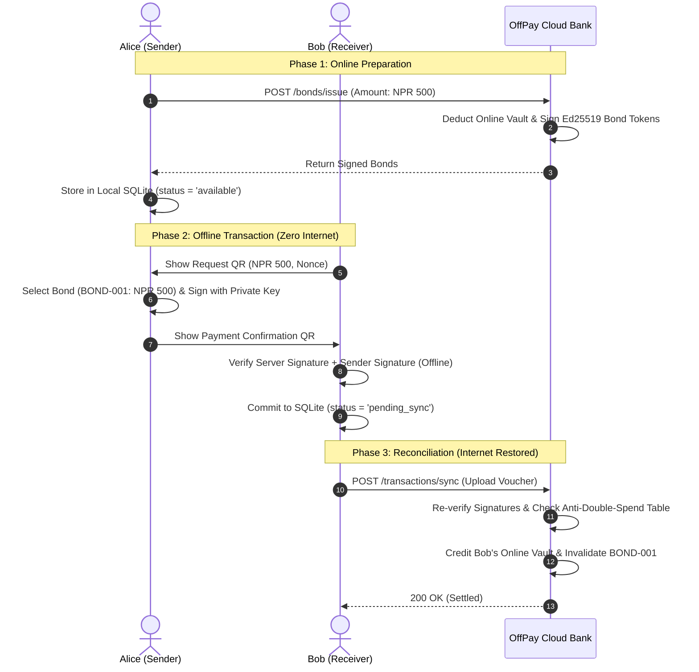

# 🏛️ Architecture & System Vision

> **Navigation**: [Docs Portal](file:///d:/BNKS_HimaliX/docs/README.md) | **Next**: [02. Cryptography & Security](file:///d:/BNKS_HimaliX/docs/02-cryptography-and-security.md)

---

## 1. Executive Summary & Problem Context

In contemporary financial technology, digital payment systems (eSewa, Khalti, Google Pay, Apple Pay) rely on **centralized account-based ledgers**. When user $A$ sends money to user $B$, both devices or the sender must contact a central server over an active internet connection to authenticate, debit user $A$'s balance, credit user $B$'s balance, and return a transaction confirmation.

```
Traditional Flow:  [Sender] ──(Internet Required)──► [Central Server] ──(Internet Required)──► [Receiver]
OffPay Flow:       [Sender] ◄──(Zero Internet: Dynamic QR Handshake)──► [Receiver]
```

### 1.1 Key Pain Points in Nepal and Off-Grid Environments
* **Geographical Network Exclusion**: In remote Himalayan trekking regions (e.g. Annapurna, Everest trails, Mustang) and rural villages, cellular connectivity is non-existent. Travelers, guides, and merchants are forced to transact strictly with physical cash.
* **Urban Friction & Cost**: In urban centers (Kathmandu, Pokhara), free Wi-Fi is scarce or insecure. Purchasing cellular data packages to pay micropayments (e.g., spending NPR 10 of mobile data to pay NPR 20 for tea) is economically inefficient.
* **Disaster Resilience**: During earthquakes, floods, or infrastructural blackouts, standard banking rails collapse immediately.
* **Cash Liabilities**: Physical cash is vulnerable to theft, loss, physical degradation, and lacks an immutable digital audit trail.

---

## 2. The OffPay Token Paradigm: Digital Banknotes

To overcome the requirement for real-time central server connectivity, OffPay replaces continuous mutable balances with **discrete cryptographically signed tokens** termed **"Bonds"**.

```
┌────────────────────────────────────────────────────────┐
│                   OFFPAY BOND TOKEN                    │
├────────────────────────────────────────────────────────┤
│ • Serial ID: BOND-7a8f1e-500                           │
│ • Denomination: NPR 500                                │
│ • Owner UUID: usr-a1b2c3d4-e5f6-7890                   │
│ • Minted Timestamp: 2026-08-22T08:00:00Z               │
│ • Expiry: 30 Days (2026-09-22T08:00:00Z)               │
│ • Server Digital Watermark: Ed25519 Signature (64B)    │
└────────────────────────────────────────────────────────┘
```

A Bond is mathematically equivalent to a physical banknote:
1. **Fixed Denominations**: Issued in standardized amounts (**NPR 100, 200, 500, 1000**).
2. **Unforgeable Signature**: Signed with the Central Server's private key before being saved on the client.
3. **P2P Transferability**: Can be transferred directly between two devices using a two-way dynamic QR handshake.
4. **Velocity Limit**: Maximum offline bond capacity is capped at **NPR 3,000** per user to minimize financial risk.

---

## 3. Dual-Balance Architecture

OffPay segregates user capital into two distinct compartments:

```
                               ┌─────────────────────────┐
                               │      TOTAL ASSETS       │
                               │        NPR 5,000        │
                               └────────────┬────────────┘
                                            │
                     ┌──────────────────────┴──────────────────────┐
                     ▼                                             ▼
       ┌───────────────────────────┐                 ┌───────────────────────────┐
       │     ONLINE BANK VAULT     │                 │   OFFLINE SECURED POCKET  │
       │         NPR 3,000         │                 │         NPR 2,000         │
       ├───────────────────────────┤                 ├───────────────────────────┤
       │ • Server-backed           │                 │ • Encrypted on device     │
       │ • Online transfers        │                 │ • 100% Zero-Internet P2P  │
       │ • Card / Bank top-ups     │                 │ • Discrete signed bonds   │
       └───────────────────────────┘                 └───────────────────────────┘
```

### Lifecycle Operations:
* **Load Bond (Online → Offline)**: User converts NPR from their Online Vault into signed offline bonds stored in SQLite.
* **Spend Bond (Offline P2P)**: Offline bonds are transferred to a counterparty through cryptographically signed QR codes.
* **Reverse Bond (Offline → Online)**: Unspent offline bonds are deposited back into the Online Vault when connected to the internet.
* **Sync & Settle (Reconciliation)**: Received offline vouchers are submitted to the central ledger upon internet reconnection.

---

## 4. End-to-End System Flow


