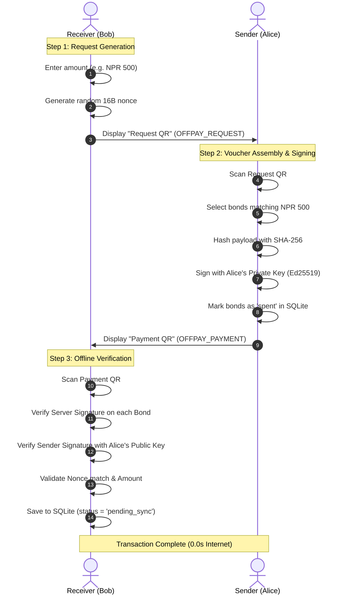

# 📲 Offline Dynamic QR Handshake Protocol

> **Navigation**: [Docs Portal](file:///d:/BNKS_HimaliX/docs/README.md) | [02. Cryptography](file:///d:/BNKS_HimaliX/docs/02-cryptography-and-security.md) | **Next**: [04. Database & Sync](file:///d:/BNKS_HimaliX/docs/04-database-and-sync-engine.md)

---

## 1. Two-Way Dynamic Handshake Sequence

Because standard Bluetooth or Wi-Fi Direct protocols suffer from device-pairing latency and permission issues, OffPay utilizes **Two-Way Optical QR Code Transmission**.



---

## 2. JSON Payload Specifications

### 2.1 Request QR Payload (`OFFPAY_REQUEST`)
Generated by the receiver to declare the desired transaction amount:

```json
{
  "type": "OFFPAY_REQUEST",
  "receiverId": "usr-b2c3d4e5-f6a7-8901-abcd-ef1234567890",
  "receiverName": "Sita Devi",
  "amount": 500,
  "currency": "NPR",
  "timestamp": "2026-08-22T10:15:30.000Z",
  "nonce": "e4a78c1b9f023d45"
}
```

### 2.2 Payment QR Payload (`OFFPAY_PAYMENT`)
Generated by the sender containing the cryptographically signed bonds:

```json
{
  "type": "OFFPAY_PAYMENT",
  "txId": "tx-8f2a1b9c-4e3d-7890-bcde-fa2345678901",
  "senderId": "usr-a1b2c3d4-e5f6-7890-abcd-ef1234567890",
  "senderName": "Aarav Sharma",
  "receiverId": "usr-b2c3d4e5-f6a7-8901-abcd-ef1234567890",
  "totalAmount": 500,
  "currency": "NPR",
  "bonds": [
    {
      "bondId": "BOND-001",
      "value": 200,
      "serverSignature": "302a300506032b6570032100d7a8f0c1e2b3a4d5e6f7..."
    },
    {
      "bondId": "BOND-002",
      "value": 200,
      "serverSignature": "8a7b9c1d2e3f4a5b6c7d8e9f0a1b2c3d4e5f6a7b8c9d..."
    },
    {
      "bondId": "BOND-003",
      "value": 100,
      "serverSignature": "f1e2d3c4b5a697887766554433221100aabbccddeeff..."
    }
  ],
  "timestamp": "2026-08-22T10:16:02.000Z",
  "nonce": "e4a78c1b9f023d45",
  "senderSignature": "7c8d9e0f1a2b3c4d5e6f7a8b9c0d1e2f3a4b5c6d7e8f9a0b1c2d3e4f5a6b7c8d"
}
```

---

## 3. Density & Error Correction Optimization
* **Encoding Format**: Raw UTF-8 Minified JSON.
* **QR Version & Correction**: Standard Version 9–11 QR with **Level L (7%) error correction** to ensure the payload stays under 450 characters.
* **Scan Latency**: Scans within **150ms–300ms** on standard smartphone cameras under low-light or outdoor sunlight.
