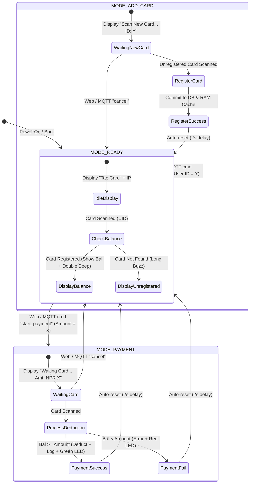

# 📟 OffPay Hardware Terminal: Technical Architecture & System Guide

> **BondPay (OffPay Hardware Terminal)**: A rugged, standalone, offline-first RFID Point-of-Sale (POS) and merchant terminal designed for zero-connectivity environments, highland trade posts, trekking lodges, transit checkpoints, and disaster-relief zones.

---

## 📑 Table of Contents
1. [Executive Summary & Use Cases](#1-executive-summary--use-cases)
2. [Hardware Component & Bill of Materials (BOM)](#2-hardware-component--bill-of-materials-bom)
3. [Pinout & Electrical Wiring Specification](#3-pinout--electrical-wiring-specification)
4. [Firmware Architecture & State Machine](#4-firmware-architecture--state-machine)
5. [Storage Layer & RAM Cache Optimization](#5-storage-layer--ram-cache-optimization)
6. [Dual Connectivity: Local REST API & Cloud MQTT Sync](#6-dual-connectivity-local-rest-api--cloud-mqtt-sync)
7. [Web Management Interface (`bondpay-ui.html`)](#7-web-management-interface-bondpay-uihtml)
8. [Multi-Device Pairing & Live Event Synchronization](#8-multi-device-pairing--live-event-synchronization)
9. [Developer Setup, Flashing & Calibration Guide](#9-developer-setup-flashing--calibration-guide)
10. [Troubleshooting & Diagnostics](#10-troubleshooting--diagnostics)

---

## 1. Executive Summary & Use Cases

### 1.1 Problem Context
In off-grid regions (such as the Annapurna, Everest, and Langtang trekking circuits of Nepal), merchant transactions are hindered by:
- **Zero Cellular/Internet Connectivity**: Traditional cloud POS machines and card readers fail entirely.
- **Power Constraints**: Bulky, power-hungry merchant systems cannot run on solar micro-grids.
- **High Cash Handling Friction**: Carrying, counting, and securing paper banknotes at high altitudes poses theft and environmental damage risks.

### 1.2 The BondPay Hardware Solution
The **BondPay Hardware Terminal** is an ultra-low-power, embedded RFID transaction engine built on the ESP32 / ESP8266 architecture:
- **100% Standalone Offline Processing**: Performs card balance deductions, cryptographically stores transaction ledgers, and gives instant audio-visual feedback in **under 20 milliseconds**.
- **Dual-State Connectivity**:
  1. *Zero Network*: Fully operates with local LCD display, buzzer, and flash storage.
  2. *Local Network (LAN)*: Serves an embedded JSON REST API on the local Wi-Fi subnet.
  3. *Internet Available (MQTT Cloud)*: Broadcasts transactions and syncs with cloud dashboards in real time across the globe.

```
┌────────────────────────────────────────────────────────────────────────┐
│                      BONDPAY HARDWARE ECOSYSTEM                        │
├────────────────────────────────────────────────────────────────────────┤
│                                                                        │
│   [ RFID Card / Bond Token ]                                           │
│               │ (13.56MHz NFC/RFID Tap)                                │
│               ▼                                                        │
│   ┌────────────────────────┐         ┌──────────────────────────────┐  │
│   │ ESP32 / ESP8266 Node   │ ◄─────► │ 16x2 I2C LiquidCrystal Display│  │
│   │ • RAM Cache (Fast DB)  │         │ • Live Amount & Balance      │  │
│   │ • LittleFS Flash DB    │         └──────────────────────────────┘  │
│   │ • Cryptographic Ledger │         ┌──────────────────────────────┐  │
│   └───────────┬────────────┘ ◄─────► │ Audio/Visual Feedback        │  │
│               │                      │ • Buzzer + Green/Red LEDs    │  │
│               │                      └──────────────────────────────┘  │
│    ┌──────────┴──────────┐                                             │
│    │                     │                                             │
│    ▼                     ▼                                             │
│ [ Local Wi-Fi REST API ] [ Cloud MQTT Sync ]                           │
│  • Direct Browser UI     • Global Phone / PC Pairing                   │
│  • Port 80 JSON Endpoints • Sub-100ms Event Broadcasting               │
└────────────────────────────────────────────────────────────────────────┘
```

---

## 2. Hardware Component & Bill of Materials (BOM)

| Component | Model / Spec | Purpose | Operating Voltage |
| :--- | :--- | :--- | :--- |
| **Microcontroller** | ESP32-WROOM-32 or ESP8266 (NodeMCU v3) | Central processing, state machine, HTTP & MQTT servers | 3.3V Logic (5V USB in) |
| **RFID Reader** | MFRC522 (13.56 MHz RFID/NFC) | Contactless card detection & UID verification | 3.3V (SPI) |
| **Display** | 1602 LCD + I2C PCF8574 Backpack | Visual user feedback (Station mode, cardholder, balance) | 5.0V (I2C) |
| **Audio Feedback** | 5V Active Buzzer Module | Distinct audio cues (Double beep = OK, Long buzz = Error) | 3.3V - 5V |
| **Visual Indicators** | 5mm High-Brightness Green/Red LEDs | Transaction success / failure indicators | 3.3V (with 220Ω resistor) |
| **Input Button** | Tactile Push Button (Momentary) | Mode switching / 3-second hold hardware factory reset | Pull-up to 3.3V |
| **Power Supply** | 5V / 1A Micro-USB or Li-Ion 18650 Pack | Portable field power | 5V DC |

---

## 3. Pinout & Electrical Wiring Specification

### 3.1 NodeMCU ESP8266 Pin Mapping Table

```
      NodeMCU ESP8266                     MFRC522 RFID Module
   ┌────────────────────┐                ┌────────────────────┐
   │ 3.3V               ├───────────────►│ 3.3V (VCC)         │
   │ GND                ├───────────────►│ GND                │
   │ D4 (GPIO2)         ├───────────────►│ SDA (SS)           │
   │ D5 (GPIO14)        ├───────────────►│ SCK                │
   │ D7 (GPIO13)        ├───────────────►│ MOSI               │
   │ D6 (GPIO12)        ├───────────────►│ MISO               │
   │ RST (Disabled/255) │                │ RST                │
   └────────────────────┘                └────────────────────┘

      NodeMCU ESP8266                     1602 LCD (I2C Backpack)
   ┌────────────────────┐                ┌────────────────────┐
   │ Vin (5V)           ├───────────────►│ VCC                │
   │ GND                ├───────────────►│ GND                │
   │ D2 (GPIO4)         ├───────────────►│ SDA                │
   │ D1 (GPIO5)         ├───────────────►│ SCL                │
   └────────────────────┘                └────────────────────┘

      NodeMCU ESP8266                     Peripherals & Signals
   ┌────────────────────┐                ┌────────────────────┐
   │ D0 (GPIO16)        ├───────────────►│ Active Buzzer (+)  │
   │ D8 (GPIO15)        ├───────────────►│ Status LED (+)     │
   │ D3 (GPIO0)         ├───────────────►│ Reset Button (GND) │
   └────────────────────┘                └────────────────────┘
```

> [!CAUTION]
> **Voltage Warning**: The MFRC522 RFID reader requires **3.3V power**. Connecting it to 5V will permanently damage the SPI transceiver. The I2C LCD module operates at **5V (Vin)**.

---

## 4. Firmware Architecture & State Machine

The firmware is structured into modular C++ headers under [`Bond_Pay_Terminal/main/`](file:///d:/BNKS_HimaliX/Bond_Pay_Terminal/main/):

```
Bond_Pay_Terminal/main/
├── main.ino        # Core initialization, loop state machine, GPIO & RFID polling
├── storage.h       # LittleFS flash persistence + RAM cache synchronization
├── payment.h       # Balance deduction, transaction logging & audio/visual feedback
├── rfid.h          # MFRC522 SPI initialization & tag reading
├── web.h           # HTTP CORS headers & web server utilities
└── mqtt_sync.h     # Cloud MQTT client, topics, presence & command dispatch
```

### 4.1 State Machine Logic



---

## 5. Storage Layer & RAM Cache Optimization

Microcontroller flash writes (EEPROM / SPIFFS / LittleFS) have higher latency (~30-50ms) and finite write cycles. BondPay uses an **Ultra-Fast In-Memory RAM Cache Architecture**:

1. **Boot Initialization**:
   - LittleFS loads `/cards.json`, `/transactions.json`, and `/settings.json` into static `std::vector<Card>` and `std::vector<Transaction>` structures in RAM.
   - Pre-serializes cached JSON strings (`cachedCardsJson`, `cachedTransactionsJson`).
2. **Sub-Millisecond Read Latency**:
   - HTTP `/api/cards` and `/api/transactions` requests serve directly from pre-rendered RAM strings in **under 2 milliseconds**.
3. **Safe Asynchronous Commit**:
   - Deductions modify RAM immediately and commit the delta to LittleFS flash.
   - Transaction history is capped at **100 entries** in flash to prevent out-of-memory (OOM) conditions.

---

## 6. Dual Connectivity: Local REST API & Cloud MQTT Sync

### 6.1 Local REST API Endpoints (Port 80)

| Route | Method | Description | Response Payload Sample |
| :--- | :--- | :--- | :--- |
| `/api/status` | `GET` | Terminal mode, heap, uptime, last event | `{"mode":"READY","activeAmount":0,"freeHeap":245760,"uptime":120000,"ip":"192.168.1.100"}` |
| `/api/cards` | `GET` | List all registered cards & balances | `[{"uid":"A3 F8 12 B9","name":"Sakshyam","balance":2500}]` |
| `/api/cards/add` | `POST` | Put terminal in card registration mode | `{"ok":true}` |
| `/api/cards/update-balance` | `POST` | Modify specific card balance | `{"ok":true}` |
| `/api/payment/start` | `POST` | Activate payment waiting mode | `{"ok":true}` |
| `/api/payment/cancel` | `POST` | Cancel active payment mode | `{"ok":true}` |
| `/api/transactions` | `GET` | Full transaction ledger | `[{"id":1,"uid":"A3 F8 12 B9","amount":150,"status":"Success"}]` |
| `/api/transactions/clear`| `POST` | Flush local logs | `{"ok":true}` |
| `/api/time` | `POST` | Synchronize epoch clock | `{"ok":true}` |

---

## 7. Web Management Interface (`bondpay-ui.html`)

[`bondpay-ui.html`](file:///d:/BNKS_HimaliX/Bond_Pay_Terminal/bondpay-ui.html) is a single-file, zero-dependency management portal engineered with a clean, high-contrast monochrome design system:

- **Live Overview Dashboard**:
  - Total station balance across all issued cards.
  - Active registered card counter and total transaction volume.
  - Live hardware metrics (ESP IP, free heap memory, station uptime).
- **Payment Terminal Sidebar**:
  - Quick-amount selectors (`NPR 50`, `100`, `200`, `500`, `1000`, `2000`).
  - Custom amount input with 1-click **Initiate Payment** trigger.
- **Card Registration & Management**:
  - Customer name, User ID, and starting balance inputs.
  - Live card list with inline **Edit Balance** and **Delete Card** controls.
- **Searchable Transaction Ledger**:
  - Filter by customer name, card UID, status (`Success` / `Failed`), or timestamp.
  - Instant CSV export and ledger synchronization.

---

## 8. Multi-Device Pairing & Live Event Synchronization

Using the **MQTT Cloud Sync Engine**, any number of cashier PCs, mobile phones, and physical terminals can link onto the same channel:

```
[ Device A: Cashier Phone ]  ──► (Publishes "start_payment NPR 500") ──► [ MQTT Broker ]
                                                                                │
                  ┌─────────────────────────────────────────────────────────────┴────────────────────────┐
                  ▼                                                                                      ▼
      [ Device B: Customer Screen ]                                                           [ ESP32 Hardware Terminal ]
  Displays "Waiting for Card Tap NPR 500"                                                 LCD Shows "Waiting Card... Amt: 500"
                  │                                                                                      │
                  │                                                                                      ▼
                  │                                                                              [ RFID Card Tapped ]
                  │                                                                                      │
                  ◄──────────────── (Broadcasts Event "Success: NPR 500 Deducted") ◄──────────────────────┘
                  │
        [ Step-by-Step Animation ]
        1. Connection Initialized
        2. Card Tapped
        3. Authorizing Transaction
        4. Payment Successful (NPR 500 Charged | NPR 2,000 Remaining)
```

### 8.1 Pairing Protocol
1. On any device, click **Pair** in the top header.
2. A unique **QR Code** and direct pairing URL (e.g., `http://.../bondpay-ui.html?channel=bp-station-01&mode=mqtt`) are rendered.
3. Scanning the QR code on a second phone or opening the link instantly connects to the same MQTT channel.
4. The **Synced Peers** badge updates dynamically (e.g., `2 Devices in Sync`).

---

## 9. Developer Setup, Flashing & Calibration Guide

### 9.1 Required Arduino Libraries
In Arduino IDE, open **Tools > Manage Libraries...** and install:
1. **MFRC522** by *GithubCommunity* (v1.4.10+)
2. **LiquidCrystal_I2C** by *Frank de Brabander* (v1.1.2+)
3. **ArduinoJson** by *Benoît Blanchon* (v6.21.x or v7.x)
4. **PubSubClient** by *Nick O'Leary* (v2.8+)
5. **LittleFS** (Built into ESP8266 / ESP32 core packages)

### 9.2 Configuration Setup
1. Open [`Bond_Pay_Terminal/main/main.ino`](file:///d:/BNKS_HimaliX/Bond_Pay_Terminal/main/main.ino).
2. Set your local Wi-Fi credentials:
   ```cpp
   const char* WIFI_SSID     = "Your_WiFi_SSID";
   const char* WIFI_PASSWORD = "Your_WiFi_Password";
   ```
3. In [`Bond_Pay_Terminal/main/mqtt_sync.h`](file:///d:/BNKS_HimaliX/Bond_Pay_Terminal/main/mqtt_sync.h), set your channel code:
   ```cpp
   #define MQTT_BROKER   "broker.emqx.io"
   #define MQTT_PORT     1883
   #define MQTT_CHANNEL  "bp-station-01"
   ```

### 9.3 Flashing Settings
- **Board**: `NodeMCU 1.0 (ESP-12E Module)` or `ESP32 Dev Module`
- **CPU Frequency**: `80 MHz` (or `160 MHz` for maximum throughput)
- **Flash Size**: `4MB (FS:2MB OTA:~1019KB)`
- **Upload Speed**: `115200` or `921600`
- **Port**: Select your USB-to-UART COM port.

---

## 10. Troubleshooting & Diagnostics

| Symptom | Probable Cause | Corrective Action |
| :--- | :--- | :--- |
| **LCD is blank / shows blocks** | Incorrect I2C address or contrast potentiometer | Turn blue potentiometer on back of I2C backpack. Run I2C scanner (default address is `0x27` or `0x3F`). |
| **RFID card not reading** | Loose SPI wiring or 5V power applied to MFRC522 | Ensure MFRC522 is powered strictly from **3.3V**. Check `SS_PIN` (D4/GPIO2). |
| **"WiFi FAILED!" on LCD** | Incorrect SSID/password or 5GHz Wi-Fi | ESP microcontrollers only connect to **2.4 GHz** Wi-Fi networks. |
| **Web UI cannot connect (LAN mode)** | Cross-subnet isolation / client isolation | Ensure computer and ESP are on the same Wi-Fi router. Alternatively, use **Cloud MQTT Mode**. |
| **Hardware Factory Reset** | Corrupted database or manual purge requested | Press and hold the **D3 Button (GPIO0)** for **3 seconds**. The LCD will display *"Factory Reset... Please Wait"* and reboot with a fresh database. |
